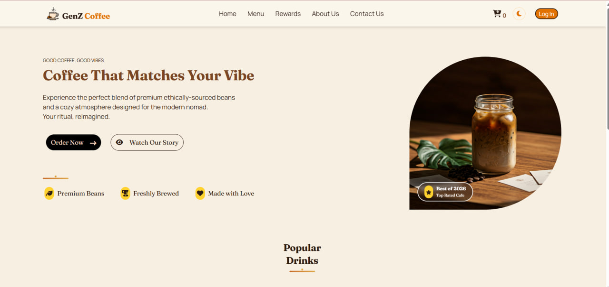
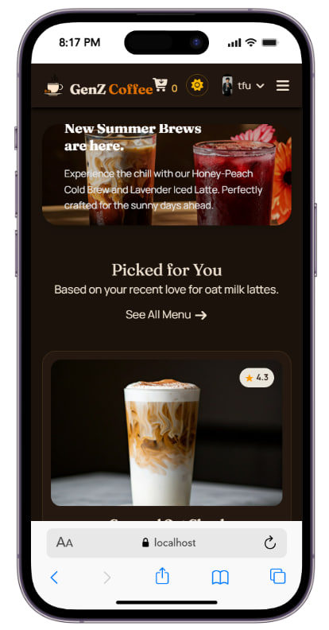
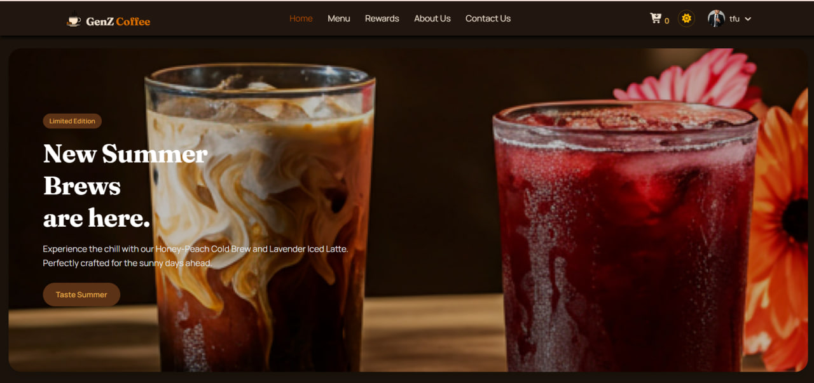
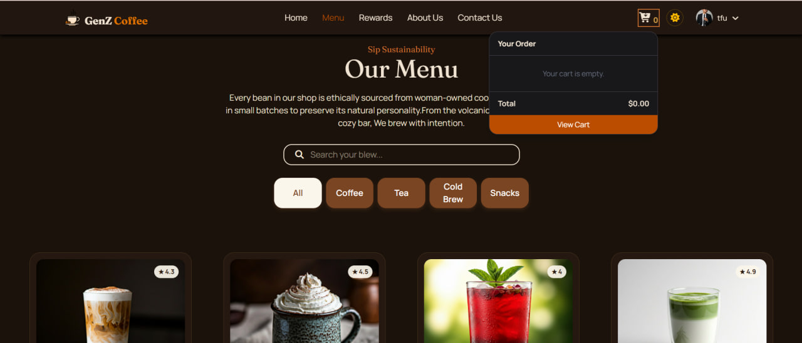
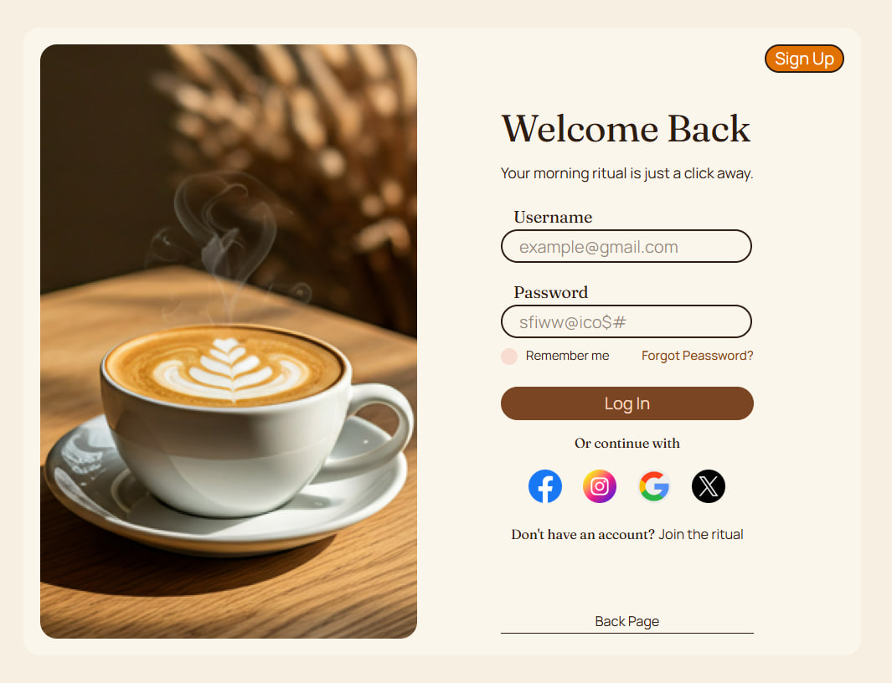

# GenZ Coffee ☕

A fully responsive **coffee shop business website**, built as the final project for the Web Design course. It's a static multi-page site (no backend/database) with a dynamic menu, working cart, sign up / login, dark mode, and scroll/loading animations — styled with Tailwind CSS and bundled with Vite.

- **Live demo:** _add your Vercel URL here after deploying, e.g. `https://GenZCoffee.vercel.app`_
- **GitHub repo:** _add your repo URL here_

## Description

GenZ Coffee is a fictional coffee brand landing site aimed at a Gen-Z audience. It showcases a home page, a searchable/filterable menu, a shopping cart, a rewards/loyalty page, an about page, and a contact page — plus account creation and login, all running entirely in the browser.

## Design System

Global look and feel lives in `src/style.css` and cascades to every page through shared utility classes (`color1`–`color6`, `.btnMenu`, `.card1`, `.cafe-badge`, etc.), so changing a token there updates the whole site.

**Typography**
- Display (headings, `h1`–`h6`): [Fraunces](https://fonts.google.com/specimen/Fraunces) — a warm, ink-trap serif that suits an artisan coffee brand better than a generic system serif.
- Body: [Manrope](https://fonts.google.com/specimen/Manrope) — a clean geometric sans for paragraphs, buttons, and labels.

**Color tokens** (defined as CSS custom properties, with dark-mode overrides)

| Token | Light value | Use |
|---|---|---|
| `--cream` | `#f7efe1` | Page background |
| `--cream-soft` | `#fbf6ec` | Card / surface background |
| `--espresso` | `#2c1c12` | Primary text |
| `--roast` | `#7a4522` | Primary brand color (buttons, links, `color5`) |
| `--roast-deep` | `#5c3216` | Hover/active states |
| `--clay` | `#c9702f` | Accent (hover, focus outline, `color6`) |
| `--gold` | `#e0a94a` | Highlights (badges, dark-mode brand text) |

In dark mode, `--bg-color`, `--text-color`, and `--card-bg` swap to an espresso-black/cream-text scheme so contrast stays readable.

**Signature detail**: a `.pour-rule` divider (a short gradient line with a "drip" dot) replaces plain `<hr>` rules under section headings, tying the UI back to the coffee theme.

## Features

- 🎨 **Modern, responsive UI** — mobile hamburger menu, fluid grid layouts, and a custom design system (Tailwind CSS v4) built around an espresso/clay/gold color palette and a Fraunces + Manrope type pairing
- ☕ **Signature "pour-rule" divider** — a small gradient drip-line accent used under section headings, in place of a plain `<hr>`
- ♿ **Accessibility touches** — visible keyboard focus states on links/buttons/inputs, and `prefers-reduced-motion` support that disables animations for users who request it
- 🌗 **Dark mode** — toggle in the navbar, preference saved to `localStorage`, respects system preference on first visit
- ⏳ **Loading animation** — spinner shown while the page's navbar/footer/data are fetched
- 🖱 **Scroll animations** — sections fade/slide into view as you scroll (`IntersectionObserver`)
- 🧭 **Working navigation** — active-link highlighting, mobile menu toggle, shared navbar/footer injected at runtime
- 🔍 **Dynamic content rendering** — the menu page renders all products from a data array, with live search + category filtering
- 🛒 **Shopping cart** — add from the menu or from "Order Now" buttons on other pages, adjust quantity, remove items, running total — persisted in `localStorage`. A **cart dropdown** in the navbar (click the cart icon) shows the order live and lets you increase/decrease quantity or delete items without leaving the page, in addition to the full cart page
- 🔐 **Sign up / Login / Logout** — client-side auth stored in `localStorage`, with a profile dropdown once logged in
- ✅ **Form validation with JavaScript** — required-field, email format, and password length checks on sign up; required-field checks on login and the contact form
- 🎁 **Rewards page** — loyalty points showcase
- ✉️ **Contact page** — contact form (client-side confirmation) + FAQ + embedded map

## Technologies Used

- **HTML5**
- **Tailwind CSS v4** (`@tailwindcss/vite`)
- **Vanilla JavaScript** (ES modules, no framework)
- **Vite** — dev server & multi-page production build
- **Font Awesome** — icons (via CDN)
- **Google Fonts** — Fraunces (display) + Manrope (body), loaded via CDN in `style.css`
- **Git & GitHub** — version control
- **Vercel** — deployment

## Screenshots

| Desktop Home | Mobile Home |
|---|---|
|  |  |

| Dark Mode | Menu Page |
|---|---|
|  |  |

| Cart Dropdown | Login Page |
|---|---|
|  |  |

## Project Structure

```
Final-Project/
├── index.html                 # Landing page (Vite entry point)
├── vite.config.js             # Vite config (Tailwind plugin + multi-page build inputs)
├── package.json
├── public/
│   ├── logo.jpg
│   ├── assets/photo/            # Images referenced by the navbar (must survive the build untouched)
│   └── components/
│       ├── navbar.html          # Shared navbar, injected at runtime via fetch()
│       └── footer.html          # Shared footer, injected at runtime via fetch()
└── src/
    ├── main.js                # JS entry loaded by every page; loads navbar/footer, wires up page-specific logic
    ├── style.css               # Global styles, dark-mode overrides, loader + scroll-reveal animations
    ├── assets/photo/            # Product photos and other in-app images
    ├── js/
    │   ├── data.js               # menuItems + seeded demo accounts
    │   ├── menu.js                # Menu rendering, category filter, search, "Order Now"
    │   ├── cart.js                 # Cart state (localStorage), rendering, static "Order Now" buttons
    │   ├── storage.js               # localStorage helpers (session, cart, signed-up accounts)
    │   ├── user.js                    # Login + Sign Up logic (with validation), route guard
    │   ├── navbar.js                   # Active-link highlighting, login/logout state, mobile menu, profile dropdown
    │   ├── contact.js                   # Contact form (client-side only, no backend)
    │   ├── theme.js                      # Dark/light mode toggle
    │   ├── loader.js                      # Page loading animation
    │   ├── scrollReveal.js                 # Scroll-triggered fade-in animation
    │   └── component.js                     # loadComponent() helper (fetches navbar/footer partials)
    └── pages/
        ├── home.html, menu.html, cart.html, about.html, contact.html, reward.html
        └── form/login.html, form/signup.html
```

> ⚠️ **Why `navbar.html`/`footer.html` live in `public/`, not `src/`:** they're loaded at runtime with `fetch()` rather than imported, so Vite's build never "sees" them as referenced files. Anything under `src/` that isn't imported/linked gets dropped from `npm run build`'s output — putting them in `public/` (which Vite always copies as-is) is what makes the navbar and footer actually show up on the deployed site. The same applies to any image referenced *inside* those two files, and to the product photos in `src/js/data.js`: since `item.image` is a plain string used at runtime (not an `import`), Vite can't fingerprint those files either, so they also live under `public/assets/photo/` with root-relative paths (`/assets/photo/...`).
>
> Also watch out for filename casing: a couple of source images were named `P15.jpg`/`P16.jpg`/`P17.jpg` while the code referenced `p15.jpg` etc. That's silently forgiving on Windows (case-insensitive filesystem) but **breaks on Vercel**, which runs Linux (case-sensitive). Keep filenames and references in matching case.

## Getting Started

### Prerequisites
- [Node.js](https://nodejs.org/) (v18+ recommended)

### Install dependencies
```bash
npm install
```

### Run the dev server
```bash
npm run dev
```
Open the printed local URL (usually `http://localhost:5173`).

### Build for production
```bash
npm run build
```
`vite.config.js` declares every page as a `rollupOptions.input` entry so the whole site (not just `index.html`) is included in `dist/`.

### Preview the production build locally
```bash
npm run preview
```

## Deploying

1. **Push to GitHub**
   ```bash
   git init
   git add .
   git commit -m "Final project: GenZ Coffee"
   git branch -M main
   git remote add origin <your-repo-url>
   git push -u origin main
   ```
   (Skip `git init` if this is already a repo.)

2. **Deploy to Vercel**
   - Go to [vercel.com](https://vercel.com), sign in with GitHub, click **Add New → Project**, and import this repo.
   - Framework preset: **Vite**. Build command: `vite build` (default). Output directory: `dist` (default).
   - Click **Deploy**. Vercel gives you a live URL — paste it into the "Live demo" line at the top of this README (and into your submission).

## Demo Accounts

You can log in immediately with a seeded account (see `src/js/data.js`), or create your own via **Sign Up**:

| Username | Password |
|---|---|
| `tfu` | `tfu123` |

## Known Limitations

- No real backend: login, sign-up, cart, and rewards data all live in the browser's `localStorage` — clearing site data resets everything, and accounts aren't shared across devices/browsers.
- The Contact page and some Rewards page buttons (e.g. "Copy Link", "Join the club") are decorative/showcase UI without a backend to submit to.
- No automated tests.

## License

No license specified — add one if you plan to share or publish this project.
